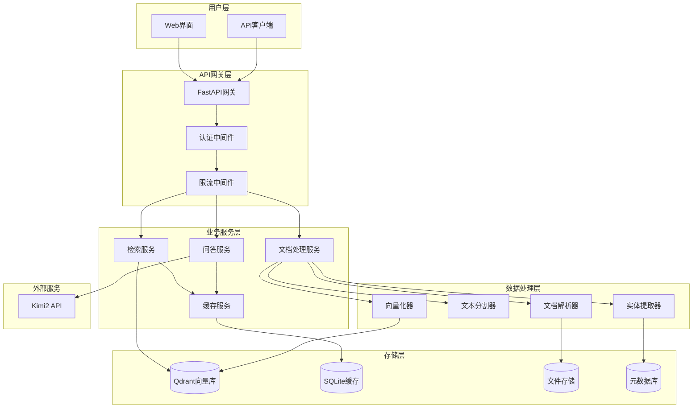
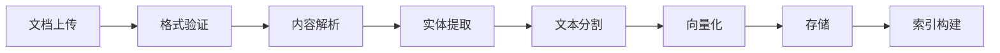
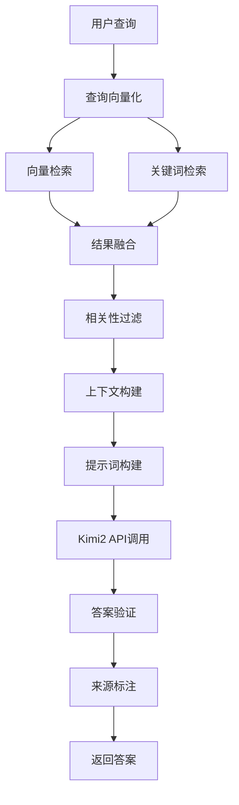

# 设计文档

## 概述

基于 Kimi2 API 的本地知识库系统采用微服务架构，严格确保所有回答仅基于用户上传的本地文档。系统通过文档解析、向量化存储、智能检索和约束性问答四个核心模块，为用户提供安全、准确的知识库服务。

## 架构设计

### 整体架构



### 核心组件架构

#### 1. 文档处理管道



#### 2. 检索与问答流程



## 组件和接口

### 1. 文档处理服务 (DocumentService)

**职责：** 处理文档上传、解析、分割和向量化

**核心接口：**
```python
class DocumentService:
    async def upload_document(self, file: UploadFile, metadata: Dict) -> DocumentInfo
    async def parse_document(self, doc_id: str) -> ParsedContent
    async def split_text(self, content: str, doc_type: str) -> List[TextChunk]
    async def generate_embeddings(self, chunks: List[TextChunk]) -> List[Vector]
    async def extract_entities(self, content: str) -> List[Entity]
    async def update_document(self, doc_id: str, file: UploadFile) -> DocumentInfo
    async def delete_document(self, doc_id: str) -> bool
```

**技术实现：**
- **文档解析器：** 使用 Unstructured 库处理 PDF、Word、PPT 等格式
- **OCR 集成：** 集成 Tesseract 处理扫描文档
- **文本分割：** 使用 LangChain TextSplitter 进行中文优化分割
- **向量化：** 使用 sentence-transformers 的 m3e-base 模型
- **实体提取：** 使用 spaCy 或自定义 NER 模型

### 2. 检索服务 (SearchService)

**职责：** 执行混合检索，融合向量检索和关键词检索结果

**核心接口：**
```python
class SearchService:
    async def vector_search(self, query_vector: Vector, top_k: int) -> List[SearchResult]
    async def keyword_search(self, query: str, top_k: int) -> List[SearchResult]
    async def hybrid_search(self, query: str, weights: Tuple[float, float]) -> List[SearchResult]
    async def filter_by_metadata(self, results: List[SearchResult], filters: Dict) -> List[SearchResult]
    async def rerank_results(self, results: List[SearchResult], query: str) -> List[SearchResult]
```

**技术实现：**
- **向量检索：** Qdrant 向量数据库，支持高效相似度搜索
- **关键词检索：** 使用 rank_bm25 实现 BM25 算法
- **结果融合：** 实现 RRF (Reciprocal Rank Fusion) 算法
- **重排序：** 基于查询相关性的二次排序

### 3. 问答服务 (QAService)

**职责：** 基于检索结果调用 Kimi2 API 生成答案，确保答案仅基于文档内容

**核心接口：**
```python
class QAService:
    async def generate_answer(self, query: str, context: List[TextChunk]) -> QAResponse
    async def validate_answer_source(self, answer: str, context: List[TextChunk]) -> bool
    async def cite_sources(self, answer: str, context: List[TextChunk]) -> List[Citation]
    async def handle_no_context(self, query: str) -> QAResponse
    async def multi_turn_conversation(self, conversation: List[Message]) -> QAResponse
```

**技术实现：**
- **API 集成：** 使用 langchain-community 的 MoonshotChat
- **提示词工程：** 设计严格的约束性提示词模板
- **答案验证：** 实现答案与文档内容的一致性检查
- **来源追溯：** 自动标注答案片段对应的文档来源

### 4. 缓存服务 (CacheService)

**职责：** 管理查询缓存，优化响应速度和降低 API 调用成本

**核心接口：**
```python
class CacheService:
    async def get_cached_result(self, query_hash: str) -> Optional[QAResponse]
    async def cache_result(self, query_hash: str, result: QAResponse, ttl: int) -> bool
    async def invalidate_cache(self, doc_id: str) -> bool
    async def get_cache_stats(self) -> CacheStats
    async def cleanup_expired_cache(self) -> int
```

**技术实现：**
- **存储引擎：** SQLite 数据库，支持持久化缓存
- **缓存策略：** LRU + TTL 混合策略
- **查询哈希：** 基于查询内容和相关文档的哈希值
- **缓存失效：** 文档更新时自动失效相关缓存

## 数据模型

### 1. 文档模型

```python
@dataclass
class Document:
    id: str
    filename: str
    file_type: str
    file_size: int
    upload_time: datetime
    last_modified: datetime
    content_hash: str
    metadata: Dict[str, Any]
    processing_status: ProcessingStatus
    version: int

@dataclass
class TextChunk:
    id: str
    document_id: str
    content: str
    chunk_index: int
    start_position: int
    end_position: int
    metadata: Dict[str, Any]
    embedding: Optional[List[float]]
```

### 2. 检索结果模型

```python
@dataclass
class SearchResult:
    chunk_id: str
    document_id: str
    content: str
    score: float
    metadata: Dict[str, Any]
    highlight: Optional[str]

@dataclass
class QAResponse:
    answer: str
    sources: List[Citation]
    confidence: float
    processing_time: float
    cached: bool
    conversation_id: Optional[str]
```

### 3. 实体关系模型

```python
@dataclass
class Entity:
    id: str
    name: str
    type: EntityType
    mentions: List[Mention]
    attributes: Dict[str, Any]

@dataclass
class Relation:
    id: str
    source_entity: str
    target_entity: str
    relation_type: str
    confidence: float
    evidence: List[str]
```

## 错误处理

### 1. 文档处理错误

- **格式不支持：** 返回支持格式列表和转换建议
- **文件损坏：** 提供文件修复指导
- **解析失败：** 降级到文本提取模式
- **向量化失败：** 重试机制和错误日志

### 2. 检索错误

- **向量库连接失败：** 降级到关键词检索
- **查询格式错误：** 自动查询修正和建议
- **无相关结果：** 扩展检索范围和同义词匹配
- **超时处理：** 异步处理和进度通知

### 3. API 调用错误

- **Kimi2 API 限流：** 智能重试和请求排队
- **API 响应超时：** 缓存机制和降级策略
- **余额不足：** 预警通知和使用量控制
- **网络异常：** 重试机制和离线模式

## 测试策略

### 1. 单元测试

- **文档解析测试：** 覆盖各种文档格式和边界情况
- **向量化测试：** 验证嵌入质量和一致性
- **检索算法测试：** 测试检索准确率和召回率
- **API 集成测试：** 模拟各种 API 响应场景

### 2. 集成测试

- **端到端流程测试：** 从文档上传到答案生成的完整流程
- **并发性能测试：** 多用户同时使用的性能表现
- **数据一致性测试：** 文档更新后的数据同步验证
- **故障恢复测试：** 各种故障场景的恢复能力

### 3. 性能测试

- **响应时间测试：** 各个接口的响应时间基准
- **吞吐量测试：** 系统的最大并发处理能力
- **内存使用测试：** 大文档处理时的内存占用
- **存储扩展测试：** 大规模文档库的存储性能

### 4. 安全测试

- **文件上传安全：** 恶意文件检测和隔离
- **数据泄露测试：** 确保文档内容不会泄露
- **API 安全测试：** 防止 API 滥用和攻击
- **权限控制测试：** 用户权限和数据隔离验证

## 部署架构

### 1. 容器化部署

```yaml
# docker-compose.yml 示例
version: '3.8'
services:
  api-gateway:
    build: ./gateway
    ports:
      - "8000:8000"
    depends_on:
      - document-service
      - search-service
      - qa-service
  
  document-service:
    build: ./services/document
    volumes:
      - ./data/documents:/app/documents
    environment:
      - QDRANT_URL=http://qdrant:6333
  
  search-service:
    build: ./services/search
    depends_on:
      - qdrant
      - cache-db
  
  qa-service:
    build: ./services/qa
    environment:
      - MOONSHOT_API_KEY=${MOONSHOT_API_KEY}
  
  qdrant:
    image: qdrant/qdrant:latest
    ports:
      - "6333:6333"
    volumes:
      - ./data/qdrant:/qdrant/storage
  
  cache-db:
    image: sqlite:latest
    volumes:
      - ./data/cache:/data
```

### 2. 扩展性设计

- **水平扩展：** 支持多实例部署和负载均衡
- **存储扩展：** 支持分布式存储和数据分片
- **缓存扩展：** 支持 Redis 集群和分布式缓存
- **API 扩展：** 支持 API 网关和服务发现

### 3. 监控和日志

- **性能监控：** Prometheus + Grafana 监控系统性能
- **日志聚合：** ELK Stack 收集和分析日志
- **错误追踪：** Sentry 追踪和报告错误
- **健康检查：** 定期检查各服务健康状态

## 安全设计

### 1. 数据安全

- **文档加密：** 静态数据 AES-256 加密存储
- **传输加密：** HTTPS/TLS 1.3 加密传输
- **访问控制：** JWT 令牌和 RBAC 权限控制
- **数据脱敏：** 自动识别和脱敏敏感信息

### 2. API 安全

- **认证授权：** OAuth 2.0 + JWT 双重认证
- **限流保护：** 基于用户和 IP 的智能限流
- **输入验证：** 严格的输入参数验证和过滤
- **CORS 配置：** 跨域请求的安全配置

### 3. 隐私保护

- **数据隔离：** 多租户数据完全隔离
- **审计日志：** 完整的操作审计和追踪
- **数据删除：** 支持数据的彻底删除
- **合规支持：** 支持 GDPR 等隐私法规要求